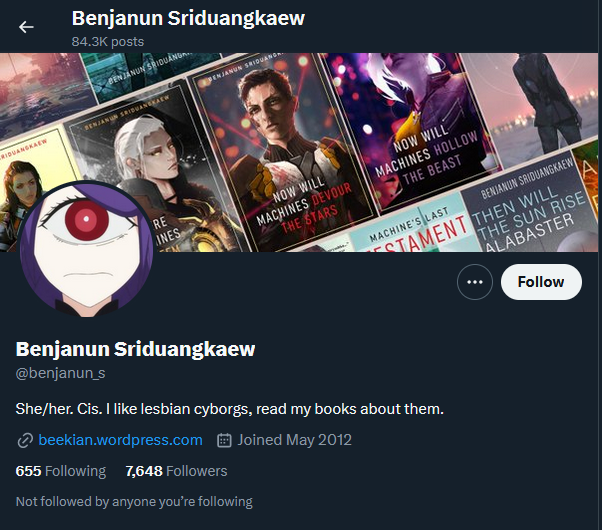
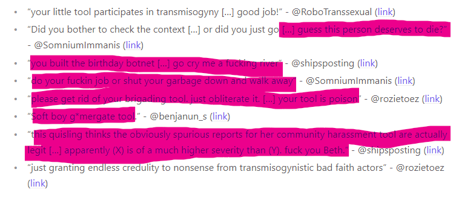

# About Benjanun Sriduangkaew.

Originally written 4/11/2024
Updated 4/20/2024

## Foreword: Why am I writing this?

[Benjanun Sriduangkaew](https://en.wikipedia.org/wiki/Benjanun_Sriduangkaew) (henceforth shortened to BS, or Bee), is at
the center of intra-community fights and the link through which I came to be harassed and involved in the situation,
and the people that follow, protect, and brigade together, has a long and storied history of manipulation, lying,
serial harassment, blackmail and abuse. She often uses DARVO to accuse victims of the very things she's doing to them,
including accusing victims of using DARVO tactics themselves[^31].

I've come to notice, after trying to understand where this brigade of bad faith actors coming to berate me and my plugin
came from, that her particular peoples express their bigotry against other progressives in social justice language.

## Summary

Benjanun (@benjanun_s) and her followers follow this playbook to a tee, and once you recognize it, you can't unsee it.

This short video will give you way more context than anything I can write here. Recommended watching in any case.

<iframe width="560" height="315" src="https://www.youtube.com/embed/Ui-ArJRqEvU?si=3NVs6ifXGurnzlYr" title="YouTube video player" frameborder="0" allow="accelerometer; autoplay; clipboard-write; encrypted-media; gyroscope; picture-in-picture; web-share" referrerpolicy="strict-origin-when-cross-origin" allowfullscreen></iframe>

In contrast to their behavior, it is my opinion that nobody is an "acceptable target" of harassment or abuse.

The most powerful thing to do is block, ignore, and pass this on. Arguing with them is only going to fuel them- they
will take a typo, a miswording, or just plainly something out of context they can make up about you and harass you as
their target of the day. Pretty standard Internet advice: don't feed the trolls.

### Context, my involvement

**If you're not interested in how I got involved, you can skip this whole section.**

On April 8th, 2024, [@autotheurgy](https://twitter.com/autotheurgy) tagged me in a
[thread](https://x.com/autotheurgy/status/1777452553782939672) saying that my add-on (Soupcan) is being
manipulated because @benjanun_s was marked as red. ([Screenshot](../assets/img/benjanun-report/callista_thread_1.png))

I had pretty much (only in passing) never heard or interacted with her before. I gave her the benefit of the doubt when a Soupcan user
expressed disapproval with her mark, and removed it, at one point in the past.

My first response to the accusation that my platform was being manipulated or gamed was to check
the reports on this user, to check for fake reports / unverifiable claims, botting, hacking,
and so on. There were a few reports that I saw, with 4 different tweet examples linked. It appeared
that these were genuine grievances. So, I [responded](https://twitter.com/bethylamine/status/1777459133404582159)
by saying they were not gamed, and [asking what made them illegitimate](https://twitter.com/bethylamine/status/1777459582740373620).
([Screenshot](../assets/img/benjanun-report/callista_thread_2.png))

Callista's response was to block me, and I [called her out on it](https://twitter.com/bethylamine/status/1777460442283290975).
([Screenshot](../assets/img/benjanun-report/beth_response_to_being_blocked.png))
I was snarky, sure. Someone had just told me something I built was effectively trash and didn't want to explain why. But
my reaction was blown way out of proportion to the point of victim blaming[^34].

After this point, I started to receive a fair amount of backlash and abuse. You can decide for yourself whether this
is a measured response, or dogpiling/bad faith criticism. Here's a selection:

* "ur fuckin trash lmao" - @baedellyy ([link](https://x.com/baedellyy/status/1777588664790392970))
* "Good faith, entirely honest. Fuck you." - @EmRoseDeLeon ([link](https://x.com/EmRoseDeLeon/status/1777931774552936892))
* "Beth hun. [..] Good luck with healing. May you find clarity. [...] Girl what the fuck actually??? How did you think this wouldnt get flak?" - DM
* "Girl how are you being this obtuse? [...] you think you're being abused right now? Get some perspective" - @EllisPritchard2 ([link](https://x.com/EllisPritchard2/status/1778089594430345445))
* "It's crazy you have time on your break to respond [...] yet you haven't responded to [...] debunking" - @estralena ([link](https://x.com/estralena/status/1778130338390135022))
* "Fuck me that extension is hot garbage" - @pacifistycuffs ([link](https://x.com/pacifistycuffs/status/1778116786786795858))
* "Not responding [...] totally doesn't come across as JAQ'ing off" - @StrategiaSE ([link](https://x.com/StrategiaSE/status/1777650744994288025))
* "I told her how shit of an idea this was [...]" - @autotheurgy ([link](https://x.com/autotheurgy/status/1777587279692759213))
* "why don't you just go work for anduril or something it feels like you'd be a good fit" - @shipsposting ([link](https://x.com/shipsposting/status/1778128813697732619))
* "trying to performatively wash your hands of how this app is being used in real time is horrifying. You're not in the community with trans fems, clearly." - @SomniumImmanis ([link](https://x.com/SomniumImmanis/status/1778124276123816279))
* "your little tool participates in transmisogyny [...] good job!" - @RoboTranssexual ([link](https://x.com/RoboTranssexual/status/1777646224767603124))
* "Did you bother to check the context [...] or did you just go [...] guess this person deserves to die?" - @SomniumImmanis ([link](https://x.com/SomniumImmanis/status/1778126757440504175))
* "you built the birthday botnet [...] go cry me a fucking river" - @shipsposting ([link](https://x.com/shipsposting/status/1778128029522199004))
* "do your fuckin job or shut your garbage down and walk away" - @SomniumImmanis ([link](https://x.com/SomniumImmanis/status/1778127056678920414))
* "please get rid of your brigading tool. just obliterate it. [...] your tool is poison" - @rozietoez ([link](https://x.com/rozietoez/status/1778125091555180819))
* "Soft boy g*mergate tool." - @benjanun_s ([link](https://x.com/benjanun_s/status/1777577087559463262))
* "this quisling thinks the obviously spurious reports for her community harassment tool are actually legit [...] apparently (X) is of a much higher severity than (Y). fuck you Beth." - @shipsposting ([link](https://x.com/shipsposting/status/1778116264633696419))
* "just granting endless credulity to nonsense from transmisogynistic bad faith actors" - @rozietoez ([link](https://x.com/rozietoez/status/1777465887517483274))

(You can see more [here](../assets/img/benjanun-report/selection_of_responses.png), and on Twitter.)

Keep in mind that this was all arose out of my not unquestioningly reversing a red mark on Soupcan. Which, had
I decided to go in and make changes *only* because people pressured me into doing so, that ironically *would* be platform
manipulation.

### About Soupcan
Soupcan is a browser extension that highlights users that have been reported for transphobia. Users make reports and
give reasoning, typically linking a tweet as an example, or multiple tweets. Reports are weighted based on how much
trust a user has built up in the system, which is why a bunch of new accounts who signed up on April 8th were not
able to successfully appeal Benjanun's label. The database updates generally every 24h. Red marks are frequently
appealed due to not enough evidence or mistakes being made. From experience, at least 95% of the red marks that I
see are deserved. Most reports are approved automatically and are not vetted by moderators, because there are
thousands of reports and we are all volunteers.

Soupcan, above all, is community based. This will never be perfect. There are guidelines to ensure people are on
the same page. But the alternative to this is to designate a transphobia "judge", which IMO, is worse. The tool then
just becomes a megaphone for that one person's opinions, rather than something that represents the community overall.

It is a tool to help people curate their feed on Twitter, not a tool to harass or brigade people. In the entire time
I've seen people using Soupcan, I have not once seen anyone use Soupcan to attack someone. If you read through this
whole report, you can add a Soupcan emoji to your tweet so I know you did. Just as Wikipedia is not
a source, but it can provide sources as references, Soupcan collates reports, which people can use to make up their
minds. Calling a red mark enabling "social murder"[^37] is wildly exaggerated in service of protecting Benjanun's image.

As you can see from above, the mark against BS was framed as a personal failure on my part, rather than the system
working as intended, albeit in a way they disagreed with. That said, I have planned many improvements to it and still
take constructive feedback on board.

You can read more about it and how it works on the website, [here](https://soupcan.beth.lgbt/).

# Who is Benjanun Sriduangkaew (BS)?

For context -

* She is a cis[^16] lesbian[^17] Thai-Chinese science fiction / fantasy (SFF) writer[^8].
* She has been known under the aliases Winterfox[^3][^15], Requires Only That You Hate (ROTYH)/Requires Hate (RH)[^3][^15][^22][^27], acrackedmoon[^1][^15][^27], pyrofennec[^1][^11][^15][^27], Valse de Lune[^15][^27], Lesifoere[^12][^15], and Maria Ying[^7] (as a joint pseudonum with Devi Lacroix.)
* "Benjanun Sriduangkaew" is likely another constructed identity.[^1][^12]
* She was reported to be a multi-millionaire heiress of a hotel empire, based on a supposed dox of her real name.[^12][^9][^10]
* Since at least 2009[^36], she has been infamous for:
  * castigating any dissenters with accusations of bigotry[^5]
  * directing threats of rape and assault at various people, particularly women, *especially* queer women and women of color[^15]
  * shutting down discussing by directing personal attacks, harassing commenters who liked books she didn't, making racist comments to various minority members. Her hatred lead to the death of the community dedicated to reading and discussing the works of authors of color[^15]
  * drive one woman to attempt suicide[^18], which some of her fans mocked
  * harassed a rape victim for at least six months in 2013[^15]
  * decade-long history of spewing violent, homophobic, transphobic, racist and sexist hate speech under sockpuppet accounts[^25]
  * showing no intent to change[^26].
* She issued two apologies in 2014.[^13][^14]
* BS's racist, sexist, classist behavior up until that point has been compiled in multiple places, from multiple victims and multiple reporters.[^20][^1]
* Many people have come forward as victims of her actions or to corroborate BS's pattern of harassment.[^1][^2][^3][^4][^19][^20][^21][^23][^24][^26]
  The breadth of this and time periods clearly show that this is *not* a "co-ordinated attack" on BS.

## Tropes and patterns

### "Birthday boy"

Birthday boy is obstensibly a meme about someone provoking someone else and then acting too harmless to be taken seriously[^26];
a crybully for transmisogyny[^30].

They have said[^29] it's a reference to [this tweet](../assets/img/benjanun-report/birthday-boy.png) which describes a "5'8 guy
who'd taunt every jacked, 6'3 bro he men until they'd pull their fist back to beat him up, whereupon [he] would go "heyheyheyyy
c'maahn I'm a little guy, I'm just a little guyy, no, it's also my birthday, I'm a little birthday boyy" and it somehow
always worked" and has stuck as a pejorative for a kind of trans man they are against. The term has been around since at
least August 2023[^42]. Bee herself admits that it's used "as mean words" (example 3) comparing it to "asshole", except
"asshole" isn't tied heavily to a minority group.

BS (and friends) have made many snide remarks about how "birthday boy" cannot be harmful, because it's merely a funny little joke.
* [Example 1](../assets/img/benjanun-report/bb-1.png) "birthday boy got this person to cry-type [...] WAH WAH WAH"
* [Example 2](../assets/img/benjanun-report/bb-2.png) "that deadliest of slurs, a birthday boy."
* [Example 3](../assets/img/benjanun-report/bb-3.png) "when people use mean words like 'assholes' and 'birthday boy' (wow scary slur! totally a real slur!)"
* [Example 4](../assets/img/benjanun-report/bb-4.png) "their mod team agrees that 'birthday boy' is a slur"
* [Example 5](../assets/img/benjanun-report/bb-5.png) "'birthday boy' is white supremacist apparently"
* [Example 6](../assets/img/benjanun-report/bb-6.png) "the deadly slur... birthday boy."
* [Example 7](../assets/img/benjanun-report/bb-7.png) "Birthday boy is a meme [...] the idea of 'birthday boy' being a slur is pretty laughable."

This behavior isn't new. 10 years ago, when told "It's a personal insult to call the author a 'stupid fuck'",
her response was "oh no, not personal insults to persons not present. what horror, paging Internet Nannies." as well as
"how do you cope with the internet or real life".[^6]

This is classic dog-whistle behavior of gaslighting victims into believing they're overreacting, but it's clear from
her usage, and how her followers understand her usage, that this label is used to deride and other, putting them into
a group of people who are immediately bad faith misogynists- anyone who is a man, and thus an acceptable target due to
their 'inherent privilege' ([example](../assets/img/benjanun-report/bb-misandry.png)) including of trans masc / trans men
(intersectionality has left the chat.)

Despite the surface reading of "birthday boy" to mean a particular type of behavior, it's usage shows that it paints a
broad brush over communities of people, in usages such as "bday boy central", "birthday brigade", or 'birthday twitter'

Examples of using variants of "birthday boy" as a reference to a broad group of people, and prejudicial usages:
* [Example 1](../assets/img/benjanun-report/bb-u1.png) "Bday boy central I fear"
* [Example 2](../assets/img/benjanun-report/bb-u2.png) "Birthday brigade out in full force"
* [Example 3](../assets/img/benjanun-report/bb-u3.png) "The birthday brigade had to switch to vanilla misogyny for a pace change"
* [Example 4](../assets/img/benjanun-report/bb-u6.png) "The **birthday freaks** are pretty much deluded / sounds like a birthday boy problem to me"
* [Example 5](../assets/img/benjanun-report/bb-u7.png) "I happily have moral high ground over this **pathetic birthday pig**"
* [Example 6](../assets/img/benjanun-report/bb-u8.png) "Average **birthday freak**."
* [Example 7](../assets/img/benjanun-report/bb-u9.png) "this accurate summarizes the **birthday pigs**"
* [Example 8](../assets/img/benjanun-report/bb-u10.png) "that account's a **birthday pig**, so / Naturally"
* [Example 9](../assets/img/benjanun-report/bb-u11.png) "that **birthday maggot**"
* [Example 10](../assets/img/benjanun-report/bb-u13.png) "birthday twitter"
* and more, but I got bored finding examples, given that this was just the *last month*

It's also just used as a general pejorative ([ex. 1](../assets/img/benjanun-report/bb-u4.png) and [ex. 2](../assets/img/benjanun-report/bb-u5.png).)

Her, and many of her followers, reduce intersectionality (in this case, where experiences that cis men and trans men have differ) to 'misandry doesn't exist' to justify their hatred.
* [Example 1](../assets/img/benjanun-report/misandry-1.png)

### Usage of anti-trans masc pejoratives / slurs

These examples are from people in the community and not from BS herself. They are included here
to show the kind of transphobia that exists where she goes. She is not responsible
for what other people say.

**"Zippertits"**

A pejorative that transphobes use to describe trans men, in reference to top surgery scars; a graphic description of post-surgical scarring
used to evoke mutilation and disgust. Examples of (random) transphobes using this include:

* [Example 1](https://x.com/AthrexEntity/status/1780179067372794278)[^38]
* [Example 2](https://x.com/MalokK97861047/status/1780565871724753155)[^39]
* [Example 3](https://x.com/challah_bread_/status/1780043715274293433)[^40]

and endorsement by BS, which was liked and apparently subsequently removed (as she is known to do when caught out):
* [Example 1](../assets/img/benjanun-report/bb-u14.png)[^41]

**Other cases of transphobia**

* "XX behavior"[^43] - "making the [r/egg_irl] bot use [assumes viewer is X content warning] has to be the most XX behavior i've ever seen"

## Nature of argumentation

BS and mutuals attack people using social justice language as a weapon, typically with accusations of racism or transmisogyny.
A common thread is a complete and utter lack of good faith, time and time again they will excuse heinous behavior and bring
the wrath of their followers down on anyone who pushes back. It's clear that they care primarily about optics because they
talk about "social murder" - i.e., the battering of someone's reputation as a terrible thing to do ([^37][^44]) yet have
no problem with spreading [Ship of Theseus](https://www.youtube.com/watch?v=Ui-ArJRqEvU) misrepresentations of their enemy's behavior in order to appear to have the moral
high ground, hoping that nobody will look into it too much and see for themselves. Ask for evidence. Ask why a screenshot
is conveniently cropped right before what they are saying is heinous. BS has said that their opponents are trained manipulators[^45]
and yet this is the behavior they engage in all too often.

**Examples of accusations of bigotry**

* [Example 1a](../assets/img/benjanun-report/racism-1.png) / [Example 1b](../assets/img/benjanun-report/racism-2.png) - "Mangling my name [is] disgustingly racist, especially when you're this white" / "calling me Benji [is intentionally racist, masculinizing and referring to me with the name you'd give a dog] and [they] have a long colonialist history"
* [Example 2](../assets/img/benjanun-report/misogyny-1.png) - "caping for a white person because [they're a] fellow misogynist"
* [Example 3](../assets/img/benjanun-report/misogyny-2.png) - "[you're] blaming women for the actions of an abusive patriarch wannabe. [you enjoy] being a misogynist"

**Examples of context collapse**
* Example 1. BS says "[here are] Beth's examples of hateful behavior that came her way"[^52] showing fairly tame examples
  from the list, only. She skips over "guess this person deserves to die", "cry me a fucking river", "do your fuckin job",
  "your tool is poison", "fuck you", etc. She copied the text around it, and removed what was highlighted in pink.
  
* No, those examples she presented are not in and of themselves the worst harassment. It's the collection as a whole that
  is the harassment, and she knows this.

**Ship of Theseus arguments**
They repeat things over and over until it becomes 'true', and when other people question where they're getting
that information from, or what the evidence is, they often just deflect or block ([example](../assets/img/benjanun-report/beth_response_to_being_blocked.png)).

For example, they have accused this
report (the one you're reading) of being "so worried about anti white racism"[^46], "we truly needed you to call out that and the
'anti-white racism' out here you're a lifesaver"[^48] and insinuating[^47] that that is the primary or any conclusion in this
report- simply on BS' say so[^49]. They say[^51] that this report is sourced from Kiwifarms, a known hate site, again,
on BS' say so[^50].

They have accused me of "platforming racist lies uncritically" and that I "[support] known abusers"[^53], by which they mean
I referenced something from a source they deemed to come from a racist, and that I thanked someone for pointing out
disruption in my plugin, when that someone was, to them, a "known abuser". BS has chided people for using her name wrongly,
e.g. [here](../assets/img/benjanun-report/racism-1.png) and [here](../assets/img/benjanun-report/racism-2.png) saying
this is racist, but she has no problem[^57] boosting someone who made a joke playing on the [14 words](https://en.wikipedia.org/wiki/Fourteen_Words)[^56],
a slogan adopted by white supremacists and neo-Nazis.

They have also accused me of being surrounded by racists[^54], for similar reasoning (people are bringing up the same kind
of evidence that someone they have deemed a racist did, therefore they are racists.) Even on the face of it this is absurd,
but it makes sense as a justification of their ire. Without just making things up, they wouldn't be taken seriously even
at a surface level (the same thing TERFs do, when they claim they were "fired just for saying biological sex is real", for example.)

* I don't use Kiwifarms, have an account, get information from it, or have ever sourced it. The sources I linked to also
  never referenced Kiwifarms. So, it appears that this is more of a tarring tactic to imply that I'm a serial harasser.
* I don't believe that anti-white racism is a thing, and I've said this on Twitter too[^55]. None of this report is contradictory with that position.

They will often also couch their positions as just 'feminism', for similar reasons that TERFs couch their positions as
'pro-women'.

These are so common, and frivolous, despite being serious accusations, that it's
They then defend BS by saying she's a staunch transfeminine ally[^58][^59][^60][^61][^62][^63][^64][^65], and remind people
that she's Thai/queer/lesbian[^58][^59][^60][^62][^63][^65], because the
belief they have in justifying their behavior is to make Bee the ultimate victim: a queer POC who's just trying to fight for
trans women and lesbians, being attacked and hounded by racists, which is the only reason people oppose her, and if you do
too, you must be racist, sexist, or transphobic. Their definition of an ally to trans women seems to be someone who fires laterally
within the community as "righteous anger", and then play the victim when they inevitably retaliate. She attracts victimized
people and enables this toxic behavior. That is also why they see BS as a true / strong transfem ally, because they don't
see other transfem allies going to the same lengths to "defend" them (by harassing others.)

## Defenses of BS

Much of this is in the past, but I'm keeping it here because BS defenders will still use these docs as a shield.

* "the real fuel for Mixon�s blog post is the ire of a group of white women who were enraged"[^11] / "relying on the words of powerful white people"[^6] / "this is about silencing and isolating Bee as punishment for calling out white women on racism"[^11]
  * Attributing malice and motive does not preclude the ability for us to see what was said.
  * I'm not going to argue this one way or the other, but given BS' history of wielding accusations of racism as a silencing tactic,
    and the fact that many affected were not white, I don't give this argument much credit.
  * none of this "enraged white women ire" is ever surfaced, because their comments are extremely tepid in the face of BS' unhinged remarks about maggots and being dismembered.
  * Neither is there any evidence that this is about silencing someone. This is a post hoc justification which is clear from the focus of the reports on her abuse, not her commentary about race.
* "the Mixon report is a Gish Gallop / Document dump"[^6][^11]
  * The irony of making this accusation at the start of a 140+ page rebuttal[^6] is not lost on me
  * The report was sufficiently large to cover the accusations in enough detail and no more. It cannot be a [Gish Gallop](https://en.wikipedia.org/wiki/Gish_gallop)
    because that applies to the format of formal debate: not giving your opponent time to respond to half-truths; an exploitation of
    [Brandolini's law](https://en.wikipedia.org/wiki/Brandolini%27s_law). Clearly, her defenders have had sufficient time to address the document.
* "there is plausible deniability in some of the accusations of the things she's done"[^11]
  * There is too big a laundry list of examples of her abuses and a trail of independent victims that warrant no further plausible deniability.
* "she is not engaging in DARVO"[^11]
  * Her behavior is almost a textbook example of it.
    * Deny: she gaslights victims into thinking she's not doing what she's doing (it's just a joke! it's just strong language!)[^32]
    * Attack: when confronted with evidence, BS attacks that person as being "part of an organized campaign of hatred" against her.[^33]
    * Reverse Victim and Offender: BS reinforces that she is the true victim, and has her minions come to her defense (read: dogpile her victim.)
* "Bee was criticized for speaking up about the attacks against her"[^11]
  * The source for this was two randoms talking on twitter with no external traction.
* "it's untrue that one of her targets was goaded into a suicide attempt"[^6][^11]
  * The source for this is that the exchange that was pointed to as the trigger is deemed "civil, albeit rather blunt, and certainly [not an attack]."
  * The exchange shown doesn't show goading, but it is not up to a third party to invalidate what can or can't cause someone's suicidal ideation.
  * RH herself replies in an apology "I was shocked to learn that I triggered you into a suicidal downswing. Intent doesn't matter--nor does it excuse--but I'm genuinely sorry that I caused to this"
* "the dog rape threat is bunk"[^11]
  * The reasoning for this, given in a Tumblr blog post[^27], is that they don't believe her, because Bee used different handles on every platform.
  * And they didn't specify an exact time, but rather "not all that long ago".
  * So therefore, it seems more likely that this was an imposter.
  * I understand it's hard to procure evidence that you *didn't* say something, but this reasoning clearly shows a bias
    towards believing Bee when the evidence is ambiguous.
* "Mixon's analysis of Bee's victims is statistically invalid. Dunning-Kruger incompetence."[^11]
  * Mixon argues that Bee's targets are disproportionately POC, and uses an unvalidated assumption that the rates of publications of POC authors are roughly comparable between children's book writers and SFF writers.
  * This is a valid criticism. However, that doesn't mean it's wrong. Notably, the American book industry is still overwhelmingly white.
    As of 2015, white/caucasian industry respondents represented 79%[^28] - notably higher than the 60% in the racial breakdown presented
    in the Mixon report. I don't see this as a strong argument either way, though.
* "the abuse she has received is worse than the abuse she has given" (multiple places, such as "There's some references to Bee apparently having asked people about their ethnicity [...] but nobody says anything when Victor Ocampo publicly questions Bee's identity")[^6][^11]
  * Does not excuse her behavior, and the author mentions as such in the disclaimer at the top, too.
  * Victor questions the validity of a nomination for diversity if BS can't be verified as POC. This is different to
    haranguing people on the basis of their supposed race.
* "yes, she's deleted things, but it was due to stalker-related issues"[^11]
  * That doesn't explain the pattern of immediately deleting the worst of her abusive posts shortly after they've done what they needed to.
  * This explains, perhaps, shutting down entire accounts, removing personal information, and so on. But "deleted things" wasn't
    really the accusation. It was: "After an attack, she deletes her most inflammatory posts and accounts and departs,
    leaving her targets reeling and others who come later scratching their heads, unable to
    find evidence and wondering what all the fuss was about."[^1]
* "her behavior was something she's specifically apologized for"[^11]
  * There are just as many if not more cases where she has not apologized to her victims. An apology also means less
    and less each time you continue to engage in that behavior.
* "there's no way she can make the pain she did cause go away"[^11]
  * This is an unfair reading of what was being said.
  * The operative words used were "addressing the damage she has done, much less undoing it"[^1].
  * "Undoing", on a fair reading, does not imply rewriting the past. It means making amends and reconciliations--owning up to what you did and making it right.
    * If you trashed someone's house and you were asked to "undo the damage", it would be understood that you would clean it up,
      not that you were being asked to make the house never trashed to begin with.
* "Bee cannot make amends if she is silenced and ostracized"[^11]
  * She is actively posting on Twitter, and hasn't suffered any loss of exposure or income to the best of my knowledge.
  * Someone may be ostractized, but that is no excuse for them to not *attempt* to make amends.
* "Myth: RH used multiple pseudonyms to hide her actions"[^6]
  * The author argues that, "it was actually literally impossible for anyone to know of RH,
    pyrofennec, acrackedmoon and Winterfox, and not know that they were the same person."
    * It is not *literally impossible*, because it in fact *literally happened*. Multiple times.
* "Myth: RH targeted PoC women, homosexuals, and disabled people"[^6]
  * The author rests on the semantics of "targets" and "attacks", suggesting that the evidence is hearsay.
  * There are first-hand accounts from WoC of the abuse they suffered, you can decide for yourself.
    * Not a fun post to write, by Rachel Manija Brown[^2] who was raised in India[^]
    * other examples here including Cindy Pon, an Asian-American woman, and a Central Asian woman[^15]
* "Myth: RH is the leader of a cult, manipulating her followers to do her evil bidding"[^6]
  * The author dismisses this as a product of Mixon's imagination, because there is "no evidence that anyone ever did anything they did not want",
    and that "I'd like to know who Mixon things BS is holding [...] hostage and under her 'control'."
  * She manipulates her followers with DARVO, who go to war on her behalf, believing they are 'fighting the good fight'.
    The patterns of abuse that stem from interacting with that clique
    would seem to indicate that there is a culture of dogpiling that is allowed if not endorsed. If you read through this
    whole report, you can add a Soupcan emoji to your tweet so I know you did. There are many high-profile
    twitter users with extensive friend groups who do *not* incite dogpiles, so it's not fair to say that "The 'community'
    she created was far from a cult, and there is no indication that the friends she made are any different than anyone else's friends."
* "Mixon's report was motivated by loathing"[^6]
  * Whether or not this is true has no bearing on the evidence provided.
* "BS's reports were not attacks, but rather just negative reviews"[^6]
  * [Example 1](../assets/img/benjanun-report/nuke.png). �douard argues that this is a "thinking woman's 'nuke it from orbit'", which is
    *amazingly* incredulous. This is a snarky and over-the-top teardown, making accusations of internalized misogyny,
    internalized racism, creepy romance, a fleshed out rapist character, bad writing, and dubious gender politics. It is
    *not* a considered or measured response. It is not even a review. It very explicitly calls for (metaphorically) a
    'biochemical weapon to Cindy Pon's coordinates'. Any well-adjusted person would consider this vociferous rebuke an attack.
  * "she hoped to enjoy [it] because she shared Pon's gender and, to some extent, part of her racial identity. This could also
    explain why RH reacted with so much negativity to the racism and sexism she perceived in Pon's books."[^6]
    * Doesn't excuse the attack, so I'm not sure why this is relevant.
* "We are left to conclude that to Mixon, critiquing racism in a piece of fiction in a way that cannot be refuted,
  worse, that the author can appreciate the truth of the criticism, and strive to improve her work in the future
  in order to better represent characters of color in her works, is wrong. Frankly, that explanation is not really
  satisfying and I think it�s false."
  * That the author decided to see a silver lining and take feedback does not mean there wasn't an attack.
    * "Are you an amoeba? [...] It's a regurgitation done without skill, with an extra does of racism" is what author �douard
      is defending. His words are, "I file this case as not an �attack�."
* "This type of biased perception of what is acceptable behaviour, i.e. that strongly worded criticism of racism and colonialism
  is somehow worse than the racism and colonialism expressed in the first place, is common among my people"
  * I don't believe there is evidence to support this claim. Firstly, "strongly worded" underplays BS's invective.
    Secondly, I don't think anyone had a problem with suggestions of checking for potential bigotry, but rather the
    shutting-down and chilling effect that BS's words had.
  * �douard writes this off as "RH acting as an activist to improve the representation of PoC in SFF", conflating what is
    uncontroversially good (diversity) with what is being pushed back on (abusive rhetoric.)
  * However, there does appear to be a line, where "exaggerating for rhetorical effect, and interpreting these statements as
    literal death threats is stupid and disingenuous" is crossed for the author, and he does concede that "RH is then guilty of
    using hyper violent language for rhetorical effect on her personal blog and quite possibly twitter in order to illustrate
    to level to which she found Bacigalupi�s book offensive. [This is] objectionable conduct."
* "Here is how I interpret things so far. RH reads a book and is offended by some of the content. She writes a review using, for her, rather mild language."[^6]
  * BS herself admits that it is not her intention but the effect that matters, and has said it was "inexcusable"[^13].
* "Mixon is targeting RH."[^6]
  * In the literal sense, yes. RH is being targeted to shine a spotlight on her abuses.
  * The author uses the fact that "Mixon's essay had [...] coordinated release and publicity", "she published at least 2 follow-up posts",
    "discussed RH multiple times on twitter", and draws comparisons between Mixon asking for signal-boosting to that of RH "cultivating a
    sizeable cast of followers who respond to her calls to help launch attacks".
    * This is not a fair comparison, as Mixon is not asking anyone to defend her or attack RH, but rather draw more attention to her
      expose.
  * The author continues to make comparisons to liken Mixon's actions to RH's actions: "Apparently, it�s not what RH was allegedly doing that what wrong,
    because Mixon and her associtates[sic] are involved in the exact same behaviours. It�s who she was."
    * This serves no purpose but to suggest that the two are equally bad. Even if this is the case, that would still mean
      that RH's behavior is bad.
* "BS is reformed."[^6] "[it's] disingenuous to refer to something she has repeatedly apologized for because it
  shows that you aren't really after accountability but rather that you want her to stop supporting trans women
  who talk about transmisogyny"[^35]
  * The following years, including to this very day, show otherwise.

For the reasons above, [^6] appears to give way more benefit of the doubt than what I would consider reasonable for the average person.

[^11] relies a lot on an appeal to incredulity, rather than evidence / [reductio ad absurdum](https://en.wikipedia.org/wiki/Reductio_ad_absurdum), i.e. "This is so ridiculous, it can't be true."
* "for the above to have any meaning *at all*, it requires attributing *enormous* power to a single reviewer, allowing them to exert far-reaching influence over huge swathes of the publishing industry."
* "to believe that it *is* true would require that Bee have some sort of superhuman understanding of psyychology and specific person's triggers."
* "Read those exchanges. If you can figure out how they could have *possibly* been "goading"[sic] into a suicide attempt, I'd love to hear it."

## Conclusion

The harassment I received based on a red mark in Soupcan is a proxy war against who they consider the enemy, including 'birthday boys'.
It had very little to do with the Soupcan application itself, and I know this because many of the users seemingly didn't even
know how Soupcan worked or had ever used it before, before forming a biased opinion of what it does/what it means/how it works,
and then attacking me for it.

**Benjanun's actions in supporting and endorsing comments about trans men using terms like "zippertits" and "cuntboys" is
sufficient to label these actions transphobic. In addition to this, promulgating a pejorative dog whistle for trans men that paints
that demographic as intrinsically worthy of derision is also transphobic bigotry. It is a dog whistle because it is argued
that there is plausible deniability in that it is "just a joke", despite what the evidence and usages of the term reveals.
For these reasons, the reports on Benjanun in Soupcan will remain, but will be marked as "Controversial", because a large
enough community of trans people do feel supported by her.**

Nobody, including BS, deserves hatred, abuse, or bigotry. I am firmly against that. However, that does not
excuse, explain, justify BS's actions or make them irrelevant.

As tempting as it is to argue, the most powerful thing to do is block, ignore, and pass this on.
Arguing with them is only going to fuel them--they will wait until you slip up and make a mountain out of a molehill.
Or just plainly take something out of context that they can frame in a certain way and harass you as
their target of the day. Pretty standard Internet advice: don't feed the trolls.

---

[^1]: [Archived version of "A Report on Damage Done by One Individual Under Several Names"](../assets/pdf/Requires-Hate-full-report.pdf)

[^2]: [Archived version "Not a fun post to write"](https://archive.is/yf8mX)

[^3]: [Archived version of "Being an itemised list of disagreements: regarding the author Benjanun Sriduangkaew AKA requires hate"](https://archive.is/IUxUt)

[^4]: [Archived version of "Requires Hate, aka Benjanun Sriduankaew, is a multiple, serial & proven bully, liar & manipulator"](https://archive.is/pWCYa)

[^5]: [Archived version of "Desperately seeking attention"](https://archive.is/OjoW5)

[^6]: [Archived version of "A More Specific Grievance"](https://archive.is/UBqcN)

[^7]: [Amazon author bio](https://archive.is/wip/Z1j3O)

[^8]: [A Bee Writes](https://beekian.wordpress.com/about/)

[^9]: [Requires Hate Redux 2021 team write-up](https://feralsapient.com/wp-content/uploads/2021/08/Requires-Hate-Redux-2021-team-write-up.pdf)

[^10]: [Archived version of "The stalker known as Creepalicious/Roguey, Juliet E. McKenna, and narratives"](https://archive.is/vak28)

[^11]: [Archived version of "The Tale of Benjanun Sriduangkaew, Part II: Lies, Damn Lies, And Failing at Statistics"](https://archive.is/4A3XC)

[^12]: [Archived version of "Requires Hate revealed: Benjanun Sriduangkaew's true identity and her extremely privileged extended family"](https://archive.is/rF50v)

[^13]: [Archived version of "apologies and finality"](https://web.archive.org/web/20141113112029/http://requireshate.wordpress.com/)

[^14]: [Archived version of "The things that we do: on mistakes, on apologies"](https://web.archive.org/web/20141029101304/http://beekian.wordpress.com/2014/10/20/the-things-that-we-do-on-mistakes-on-apologies/)

[^15]: [Winterfox/RequiresHate/Benjanun Sriduangkaew roundup post](https://azarias.dreamwidth.org/7186.html) ([Archived](https://archive.is/UnwXT))

[^16]: [Benjanun_s on Twitter](https://twitter.com/benjanun_s) ([Archived](https://archive.is/H8ipr))

[^17]: [Benjanuns on Instagram](https://www.instagram.com/benjanuns/) ([Archived](https://archive.is/dhUX0))

[^18]: [Your one-stop shopping for trolling and bullying disguse as social justice!](https://web.archive.org/web/20120816205541/www.journalfen.net/community/unfunny_fandom/21226.html)

[^19]: [Toward Zero](https://heyheyrenay.tumblr.com/post/100370010694/toward-zero) ([Archived](https://archive.is/v2lx1))

[^20]: [Winterfraud](https://winterfraud.wordpress.com/) ([Archived](https://archive.is/C3Vqj))

[^21]: [Archived version of "Standing Up and Speaking Truth"](https://archive.is/sdjCx)

[^22]: [Archived version of "Angry Brown Woman Mode"](https://archive.is/9iBQh)

[^23]: [Die Fallstricke einer verfehlten Ideologie](https://katzenklaue.blogspot.com/2012/08/die-fallstricke-einer-verfehlten.html) ([Archived](https://archive.is/v6E0Y))

[^24]: [Archived version of "Some thoughts on the politics of trolling"](https://web.archive.org/web/20220628004014/https://alis.me/x/some-thoughts-on-the-politics-of-trolling/)

[^25]: [Daily dot: Acclaimed sci-fi writer exposed as notorious Internet troll](https://www.dailydot.com/parsec/benjanun-sriduangkaew-revealed-to-be-troll-requires-hate-winterfox/) ([Archived](https://archive.is/cwBte))

[^26]: [How Many Swallows Bring Real Spring?](https://starshipreckless.com/blog/?p=9214) ([Archived]())

[^27]: [Archived version of "Serenity Dee: SFF is still maladjusted"](https://archive.is/pajtU)

[^28]: [Diversity in Book Publishing](https://wordsrated.com/diversity-in-book-publishing/)

[^29]: [Tweet, @lisaquestions](https://x.com/lisaquestions/status/1777575551563079843) ([Screenshot](../assets/img/benjanun-report/new/36.png))

[^30]: [Tweet, @Farynnistired](https://x.com/Faerynnistired/status/1777583655080108060) ([Screenshot](../assets/img/benjanun-report/new/37.png))

[^31]: [Tweet, @benjanun_s](https://x.com/benjanun_s/status/1766563161153450024) ([Archived](https://archive.is/TCezX))

[^32]: [Tweet, @benjanun_s](https://x.com/benjanun_s/status/1763461564529791125) ([screenshot](../assets/img/benjanun-report/joke-1.png))

[^33]: [Tweet, @benjanun_s](https://x.com/benjanun_s/status/1740759348081738118) ([screenshot](../assets/img/benjanun-report/hate-campaign.png))

[^34]: [Tweet, @feuer_ameise](https://x.com/feuer_ameise/status/1777650050266522075) ([screenshot](../assets/img/benjanun-report/victim-blaming.png))

[^35]: [Tweet, @feuer_ameise](https://x.com/feuer_ameise/status/1778000506138374302) ([screenshot](../assets/img/benjanun-report/disingenuous.png))

[^36]: [RaceFail '09](https://archive.is/CB8uJ)

[^37]: [Tweet, @SomniumImmanis](https://x.com/SomniumImmanis/status/1778122540822798446) ([screenshot](../assets/img/benjanun-report/social_murder.png))

[^38]: [Tweet, @AnthrexEntity](https://x.com/AthrexEntity/status/1780179067372794278) ([screenshot](../assets/img/benjanun-report/zippertits1.png))

[^39]: [Tweet, @MalokK97861047](https://x.com/MalokK97861047/status/1780565871724753155) ([screenshot](../assets/img/benjanun-report/zippertits2.png))

[^40]: [Tweet, @challah_bread_](https://x.com/challah_bread_/status/1780043715274293433) ([screenshot](../assets/img/benjanun-report/zippertits3.png))

[^41]: [Tweet, @catladyellyy/@yuriellyy](https://twitter.com/yuriellyy/status/1743005610977993078) ([screenshot](../assets/img/benjanun-report/bb-u14.png))

[^42]: [Screenshot of tweets from @Katrafiy and @lisaquestions about the origin of "birthday boy brigade"](../assets/img/benjanun-report/bb-8.png)

[^43]: [Screenshot of tweet, @marupan_desu](../assets/img/benjanun-report/xx.jpg)

[^44]: [Screenshot of tweet, @RoboTranssexual](../assets/img/benjanun-report/new/social_murder1.png)

[^45]: [Screenshot of tweet, @benjanun_s](../assets/img/benjanun-report/new/manipulative.png)

[^46]: [Screenshot of tweet, @PissqueenAntiX](../assets/img/benjanun-report/new/anti-white1.png)

[^47]: [Screenshot of tweet, @goth__casual](../assets/img/benjanun-report/new/anti-white2.png)

[^48]: [Screenshot of tweet, @rebootanother](../assets/img/benjanun-report/new/anti-white3.png)

[^49]: [Screenshot of tweet, @benjanun_s](../assets/img/benjanun-report/new/anti-white-b.png)

[^50]: [Screenshot of tweet, @benjanun_s](../assets/img/benjanun-report/new/kw.png)

[^51]: [Screenshot of tweet, @StrategiaSE](../assets/img/benjanun-report/new/lies3.png)

[^52]: [Screenshot of tweet, @benjanun_s](../assets/img/benjanun-report/new/hateful.png)

[^53]: [Screenshot of tweet, @wyllie_ava](../assets/img/benjanun-report/new/lies.png)

[^54]: [Screenshot of tweet, @benjanun_s](../assets/img/benjanun-report/new/lies2.png)

[^55]: [Screenshot of tweet, @bethylamine](../assets/img/benjanun-report/new/seth-1.png)

[^56]: [Screenshot of tweet, @Sinister_Sophia](../assets/img/benjanun-report/new/14.png)

[^57]: [Screenshot of timeline, @benjanun_s](../assets/img/benjanun-report/new/repost.png)

[^58]: [Screenshot of tweet, @Esper_Lily](../assets/img/benjanun-report/new/idpol1.png)

[^59]: [Screenshot of tweet, @Sinister_Sophia](../assets/img/benjanun-report/new/idpol2.png)

[^60]: [Screenshot of tweet, @macfluffers](../assets/img/benjanun-report/new/idpol3.png)

[^61]: [Screenshot of tweet, @IgneousSigil](../assets/img/benjanun-report/new/idpol4.png)

[^62]: [Screenshot of tweet, @rozietoez](../assets/img/benjanun-report/new/idpol5.png)

[^63]: [Screenshot of tweet, @macfluffers](../assets/img/benjanun-report/new/idpol6.png)

[^64]: [Screenshot of tweet, @karlachsfemme](../assets/img/benjanun-report/new/idpol7.png)

[^65]: [Screenshot of tweet, @NsfwRaiko](../assets/img/benjanun-report/new/idpol8.png)
